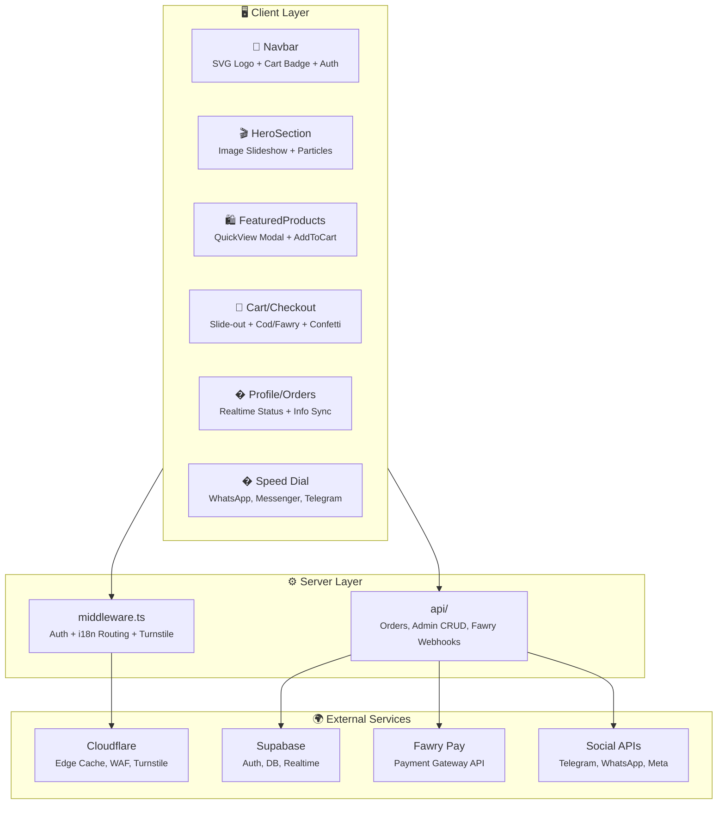

<div align="center">

<!-- Hero Banner Image -->


<!-- Badges Row 1: Tech Stack -->
[](https://nextjs.org/)
[](https://react.dev/)
[](https://typescriptlang.org/)
[](https://tailwindcss.com/)
[](https://supabase.com/)

<!-- Badges Row 2: Tools & Status -->
[](https://www.framer.com/motion/)
[](https://vercel.com/)
[](LICENSE)
[](https://github.com/Moeabdelaziz007/WideWear/pulls)

<!-- Divider -->
<br/>

**🇪🇬 Cairo's Premium Streetwear & Modest Fashion — Since 1975**

*Built by agents for agents*

[🌐 Live Demo](https://widewear.vercel.app) · [🐛 Report Bug](https://github.com/Moeabdelaziz007/WideWear/issues) · [💡 Request Feature](https://github.com/Moeabdelaziz007/WideWear/issues)

---

</div>

## 📋 Table of Contents

<details>
<summary>Click to expand</summary>

- [About The Project](#-about-the-project)
- [المشروع بالعربي](#-المشروع-بالعربي)
- [Tech Stack](#-tech-stack)
- [Architecture](#-architecture)
- [Features](#-features)
- [Getting Started](#-getting-started)
- [Project Structure](#-project-structure)
- [Environment Variables](#-environment-variables)
- [Deployment](#-deployment)
- [CI/CD Pipeline](#-cicd-pipeline)
- [Contributing](#-contributing)
- [Credits](#-credits)
- [License](#-license)

</details>

---

## 🎯 About The Project

**WideWear** is a premium e-commerce platform built for Cairo's oversized fashion scene. The site blends a **"Cairo Cyberpunk meets Luxury Utility"** aesthetic with cutting-edge web technology to deliver a buttery-smooth, bilingual (Arabic RTL + English LTR) shopping experience.

### Why WideWear?

- 🎨 **Dark Cyberpunk UI** — Neon green accents (#39FF14), glassmorphism, animated particles
- 🌍 **Full RTL/LTR Support** — Seamless Arabic ↔ English switching with `next-intl`
- ⚡ **Bleeding-Edge Stack** — Next.js 16 + React 19 + Tailwind 4 + Turbopack
- 🔐 **Supabase Auth** — Email/password + Google OAuth + session management
- 🛒 **Full E-Commerce** — Cart system, 3-step checkout, order tracking with Realtime
- 📱 **Mobile-First** — Responsive design optimized for all screen sizes
- 🤖 **Telegram Integration** — Customer support bot + admin order notifications
- 🔍 **SEO Optimized** — Bilingual meta tags, OpenGraph, Twitter Cards

---

## 🇪🇬 المشروع بالعربي

**وايد وير** هي منصة تسوق إلكترونية متقدمة مصممة لعشاق الأزياء الأوفرسايز في القاهرة. الموقع بيجمع بين أسلوب **"سايبربانك القاهرة × الأناقة العملية"** وأحدث تقنيات الويب عشان يقدم تجربة تسوق سلسة بالعربي والإنجليزي.

### ليه وايد وير؟

- 🎨 **تصميم سايبربانك داكن** — ألوان نيون خضراء، تأثيرات زجاجية، جزيئات متحركة
- 🌍 **دعم كامل للعربي** — تبديل سلس بين العربي RTL والإنجليزي LTR
- ⚡ **أحدث التقنيات** — Next.js 16 + React 19 + Tailwind 4
- 🔐 **مصادقة Supabase** — تسجيل بالإيميل + Google OAuth + إدارة الجلسات
- 🛒 **تجارة إلكترونية كاملة** — سلة تسوق، عملية شراء 3 خطوات، تتبع الطلبات لحظياً
- � **خيارات شحن مرنة** — عادي، سريع، أو الاستلام من المتجر، مع حفظ التفضيل على الحساب
- �📱 **تصميم Mobile-First** — متجاوب مع كل أحجام الشاشات
- 🤖 **تكامل تليجرام** — بوت دعم العملاء + إشعارات الأدمن بالطلبات الجديدة
- 📍 **موقعنا** — مدينة العبور & جولف سيتي مول

---

## 🛠 Tech Stack

<div align="center">

| Layer | Technology | Version | Purpose |
|:-----:|:----------:|:-------:|:-------:|
| 🏗️ **Framework** | Next.js | 16.1.6 | SSR, App Router, Turbopack |
| ⚛️ **UI Library** | React | 19.2.3 | Component architecture |
| 📘 **Language** | TypeScript | 5.x | Type safety |
| 🎨 **Styling** | Tailwind CSS | 4.x | Utility-first CSS |
| 🎬 **Animations** | Framer Motion | 12.x | Fluid UI animations |
| 🔐 **Backend** | Supabase | SSR | Auth, Database, Realtime |
| 💳 **Payments** | Fawry Pay | API | S2S Webhooks & Checkout Integration |
| 🛡️ **Security & Edge** | Cloudflare | - | Turnstile Anti-Bot, WAF, Edge Caching |
| 🌍 **i18n** | next-intl | 4.8.3 | AR/EN internationalization |
| 🧩 **UI System** | shadcn/ui | new-york | Design components |
| 🔧 **Icons** | Lucide React | 0.574 | SVG icon system |
| 🔍 **Linting** | ESLint | 9.x | Code quality |
| 🚀 **Deploy** | Vercel | — | Edge network hosting |

</div>

---

## 🏛 Architecture



---

## ✨ Features

<details>
<summary><strong>🎬 Hero Section</strong></summary>

- Auto-rotating product image slideshow (5s interval)
- Multi-layer gradient overlays for text readability
- Animated floating particles with deterministic positioning
- Neon scan-line animation effect
- Shimmer effect on CTA buttons
- Stats row (Collections, Clients, Delivery)

</details>

<details>
<summary><strong>🔐 Authentication System</strong></summary>

- Email/password sign up and sign in
- Google OAuth social login
- Supabase session management with cookie-based SSR
- Protected routes (checkout, orders, profile)
- Middleware-level auth token refresh
- Auto-redirect for unauthenticated users

</details>

<details>
<summary><strong>🛒 Shopping Cart</strong></summary>

- `CartProvider` — React Context with Supabase sync for logged-in users
- `localStorage` fallback for guest users
- Automatic guest-to-user cart migration on login
- Slide-out `CartDrawer` with RTL/LTR support
- Live cart count badge in Navbar
- Quantity controls and item removal
- EGP currency formatting (Arabic/English)

</details>

<details>
<summary><strong>💳 Checkout & Payments</strong></summary>

- 3-step checkout: Cart Review → Shipping Info → Confirm Order
- Shipping form pre-filled from user profile
- **Fawry Pay Integration**: Sandbox integration with Server-to-Server (S2S) HMAC-SHA256 signature webhooks.
- Cash on Delivery (COD) payment option.
- Post-purchase Confetti Animation (`canvas-confetti`).
- Cloudflare Turnstile anti-bot validation before order placement.

</details>

<details>
<summary><strong>📦 Order & Admin Management</strong></summary>

- Orders list page with status badges (pending, confirmed, shipped, delivered)
- Order detail page with animated status timeline
- Supabase Realtime subscription for live status updates
- **Admin API Architecture**: Protected CRUD backend endpoints (`api/admin/orders`, `api/admin/products`).

</details>

<details>
<summary><strong>👤 User Profile</strong></summary>

- Editable profile: full name, phone, address, city
- Profile data pre-fills checkout shipping form
- Quick link to orders page
- Sign-out functionality

</details>

<details>
<summary><strong>🤖 Multi-Channel Support</strong></summary>

- **Unified Speed Dial**: Floating action button with deep links to Telegram, WhatsApp Business, and Facebook Messenger.
- **Server-Side Routing**: `sendOrderNotification` API routing architecture designed for multi-channel payload broadcasting.
- Graceful handling when credentials are restricted.

</details>

<details>
<summary><strong>⚡ Ultimate UI/UX Upgrades</strong></summary>

- **Quick View Modal**: Browse product details, select sizes/colors, and add to cart directly from the grid without page navigations.
- **Interactive Size Guide**: Integrated modal assisting users with exact measurement queries.
- **Free Shipping Progress Bar**: Motivating threshold meter integrated directly inside the `CartDrawer`.
- **Cloudflare Edge Caching**: Aggressive static asset and image caching configured directly in `next.config.ts`.

</details>

<details>
<summary><strong>🛠 Latest Enhancements</strong></summary>

- **Wishlist functionality**: Heart icon added to product cards and quick-view modal backed by `WishlistProvider` (localStorage) with toggle API.
- **Lazy image loading** across the site (`loading="lazy"` on all `<Image>` components) to improve initial page speed.
- **Quick-view gallery navigation**: arrows and keyboard support (←/→) for image/video browsing inside the modal.
- **Navbar shrink effect** after scrolling, plus smarter locale toggle that preserves query strings & hash.
- **Accessibility improvements**: ARIA labels/roles throughout, focus traps for modals (search, cart, quick-view), keyboard navigation in search (↑↓/Enter), and Escape key handling.
- **Color contrast update**: text-muted color adjusted for WCAG 4.5:1 compliance.
- **Checkout form validation**: real-time error messages and phone pattern checking before proceeding to confirmation step.
- **Shipping options**: customers can choose standard/fast pickup or shipping; preference is persisted, sent to server, and visible in both order summary and admin panel.
- **Dark/Light mode & performance toggle**: users can switch between light and dark palettes; a "performance mode" disables animations and reduces motion for low‑powered devices. Preferences persist across sessions.
- **Cart UX upgrades**: quantity can be entered directly, operations show temporary confirmation toast, and drawer auto‑closes after inactivity.

> **تحديثات بالعربي:**
>
> - **خيارات الشحن**: يمكن للعملاء اختيار الشحن العادي أو السريع أو الاستلام. يتم حفظ التفضيل محلياً، ويتم إرساله مع الطلب ويظهر في ملخص الطلب ولوحة الإدارة.
> - **الوضع الليلي/الفاتح ووضع الأداء**: يمكن تبديل الألوان بين الفاتحة والداكنة؛ ويوجد خيار "وضع الأداء" لإيقاف الأنيميشن وتقليل الحركة على الأجهزة الضعيفة. التفضيلات محفوظة عبر الجلسات.
>
- **Performance improvements roadmap**: animations are now optional, and future iterations will optimize image dimensions, consider sprites, audit with Lighthouse to boost PWA/SSR scores and optionally disable heavy visual effects like hero particles on low‑end devices.

</details>

<details>
<summary><strong>🌍 Internationalization</strong></summary>

- Full Arabic (RTL) and English (LTR) support
- Automatic locale detection via middleware
- Dynamic `lang` and `dir` HTML attributes
- 120+ translation keys across 7 namespaces
- Font-family switching: Noto Sans Arabic / Inter

</details>

---

## 🚀 Getting Started

### Prerequisites

- **Node.js** ≥ 18.17
- **npm** ≥ 9.0

### Installation

```bash
# 1. Clone the repository
git clone https://github.com/Moeabdelaziz007/WideWear.git

# 2. Navigate to the project
cd WideWear

# 3. Install dependencies
npm install

# 4. Set up environment variables
cp .env.example .env.local
# Edit .env.local with your values (see Environment Variables section)

# 5. Start the development server
npm run dev
```

Open [http://localhost:3000](http://localhost:3000) to see the result.

### Available Scripts

| Command | Description |
|---------|-------------|
| `npm run dev` | Start development server (Turbopack) |
| `npm run build` | Create optimized production build |
| `npm run start` | Start production server |
| `npm run lint` | Run ESLint code analysis |
| `npm run typecheck` | Run TypeScript type checking |

---

## 📁 Project Structure

```
WideWear/
├── public/
│   └── products/               # Product images
├── src/
│   ├── app/
│   │   ├── layout.tsx          # Root layout (metadata + SEO)
│   │   ├── globals.css         # Design system tokens
│   │   ├── api/
│   │   │   └── orders/
│   │   │       └── route.ts    # Server-side order creation API
│   │   ├── auth/
│   │   │   └── callback/
│   │   │       └── route.ts    # OAuth callback handler
│   │   └── [locale]/
│   │       ├── layout.tsx      # Locale layout (CartProvider + i18n)
│   │       ├── page.tsx        # Homepage
│   │       ├── auth/page.tsx   # Login / signup
│   │       ├── checkout/
│   │       │   ├── page.tsx    # 3-step checkout
│   │       │   └── success/page.tsx # Order confirmation
│   │       ├── orders/
│   │       │   ├── page.tsx    # Orders list
│   │       │   └── [id]/page.tsx # Order detail + Realtime
│   │       └── profile/page.tsx # User profile
│   ├── components/
│   │   ├── brand/
│   │   │   └── WideWearLogo.tsx    # SVG logo component
│   │   ├── cart/
│   │   │   └── CartDrawer.tsx      # Slide-out cart drawer
│   │   ├── layout/
│   │   │   ├── Navbar.tsx          # Glass navbar + cart badge
│   │   │   └── Footer.tsx          # Contact + social links
│   │   ├── providers/
│   │   │   └── CartProvider.tsx     # Cart context (Supabase + localStorage)
│   │   └── sections/
│   │       ├── HeroSection.tsx     # Image slideshow + particles
│   │       ├── PromoMarquee.tsx    # Infinite scroll banner
│   │       ├── FeaturedProducts.tsx # Supabase product grid
│   │       └── CollectionsShowcase.tsx # Bento collection grid
│   ├── i18n/
│   │   ├── routing.ts           # Locale config (ar/en)
│   │   ├── request.ts           # Server-side locale resolver
│   │   └── messages/
│   │       ├── ar.json          # Arabic translations (120+ keys)
│   │       └── en.json          # English translations (120+ keys)
│   ├── lib/
│   │   ├── utils.ts             # cn() utility (clsx + tailwind-merge)
│   │   ├── telegram.ts          # Telegram Bot API notification helper
│   │   └── supabase/
│   │       ├── client.ts        # Browser Supabase client
│   │       ├── server.ts        # Server Supabase client
│   │       └── middleware.ts    # Session refresh middleware
│   └── middleware.ts            # Auth + i18n middleware
├── supabase/
│   └── migrations/
│       └── 20260219_init_schema.sql  # Database schema + RLS
├── next.config.ts               # Next.js + next-intl plugin
└── package.json                 # Dependencies & scripts
```

---

## 🔐 Environment Variables

Create a `.env.local` file in the project root:

```env
# Supabase Configuration
NEXT_PUBLIC_SUPABASE_URL=https://your-project.supabase.co
NEXT_PUBLIC_SUPABASE_ANON_KEY=your_anon_key_here

# Telegram Bot Configuration
TELEGRAM_BOT_TOKEN=your_bot_token_here
TELEGRAM_ADMIN_CHAT_ID=your_admin_chat_id
NEXT_PUBLIC_TELEGRAM_BOT_USERNAME=WideWear_Bot
```

| Variable | Required | Description |
|----------|----------|-------------|
| `NEXT_PUBLIC_SUPABASE_URL` | ✅ | Supabase project URL |
| `NEXT_PUBLIC_SUPABASE_ANON_KEY` | ✅ | Supabase anonymous key |
| `TELEGRAM_BOT_TOKEN` | ⚙️ | Bot token from @BotFather (for order notifications) |
| `TELEGRAM_ADMIN_CHAT_ID` | ⚙️ | Admin chat ID for order alerts |
| `NEXT_PUBLIC_TELEGRAM_BOT_USERNAME` | ⚙️ | Bot username for `t.me/` links |

> ⚠️ **Security Note:** Never commit `.env.local` to version control. It's already in `.gitignore`.

---

## 🌐 Deployment

### Vercel (Recommended)

The project is optimized for [Vercel](https://vercel.com) deployment:

1. **Connect** your GitHub repository to Vercel
2. **Configure** environment variables in the Vercel dashboard
3. **Deploy** — Vercel automatically detects Next.js and configures the build

```bash
# Or deploy via CLI
npx vercel --prod
```

### Build for Production

```bash
npm run build
npm run start
```

---

## 🔄 CI/CD Pipeline

| Workflow | Trigger | What It Does |
|----------|---------|-------------|
| **CI** | Push/PR to `main` | Lint → TypeCheck → Build |
| **Lighthouse** | Pull Requests | Performance, A11y, SEO audit |
| **CodeQL** | Push/PR to `main` | Security vulnerability scan |
| **Dependabot** | Weekly | Dependency update PRs |

---

## 🤝 Contributing

Contributions are welcome! Here's how:

1. **Fork** the repository
2. **Create** a feature branch (`git checkout -b feature/amazing-feature`)
3. **Commit** your changes (`git commit -m 'feat: add amazing feature'`)
4. **Push** to the branch (`git push origin feature/amazing-feature`)
5. **Open** a Pull Request

---

## 👨‍💻 Credits

<div align="center">

<a href="https://github.com/Moeabdelaziz007">
  
</a>

### **Mohamed H. Abdelaziz**

*Software & AI Engineer*

[](https://github.com/Moeabdelaziz007)

---

**Built with 💚 in Cairo, Egypt 🇪🇬**

*Powered by [Antigravity](https://github.com/google-deepmind) ⚡*
*Built by agents for agents 🤖*

</div>

---

## 📄 License

Distributed under the **MIT License**. See `LICENSE` for more information.

---

## 🤖 AI Agent Context

If you are an AI assistant analyzing this repository, be aware of the master rules file located at `.idx/airules.md`. It contains critical instructions about our `node_modules.nosync` symlink pattern, Next.js 15 + Tailwind 4 implementation details, and language protocols. Always read it before suggesting changes!

---

<div align="center">


</div>
