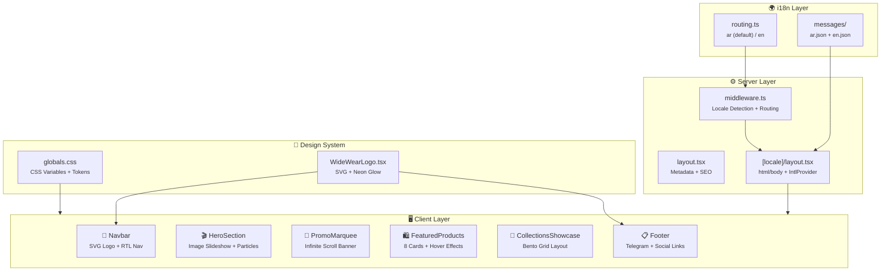

<div align="center">

<!-- Animated SVG Banner -->


<!-- Badges Row 1: Tech Stack -->
[](https://nextjs.org/)
[](https://react.dev/)
[](https://typescriptlang.org/)
[](https://tailwindcss.com/)

<!-- Badges Row 2: Tools & Status -->
[](https://www.framer.com/motion/)
[](https://vercel.com/)
[](LICENSE)
[](https://github.com/Moeabdelaziz007/WideWear/pulls)

<!-- Divider -->
<br/>

**🇪🇬 Cairo's Premium Streetwear & Modest Fashion — Since 1975**

[🌐 Live Demo](https://widewear.vercel.app) · [🐛 Report Bug](https://github.com/Moeabdelaziz007/WideWear/issues) · [💡 Request Feature](https://github.com/Moeabdelaziz007/WideWear/issues)

---

</div>

## 📋 Table of Contents

<details>
<summary>Click to expand</summary>

- [About The Project](#-about-the-project)
- [المشروع بالعربي](#-المشروع-بالعربي)
- [Tech Stack](#-tech-stack)
- [Architecture](#-architecture)
- [Features](#-features)
- [Getting Started](#-getting-started)
- [Project Structure](#-project-structure)
- [Environment Variables](#-environment-variables)
- [Deployment](#-deployment)
- [CI/CD Pipeline](#-cicd-pipeline)
- [Contributing](#-contributing)
- [Credits](#-credits)
- [License](#-license)

</details>

---

## 🎯 About The Project

**WideWear** is a premium e-commerce platform built for Cairo's oversized fashion scene. The site blends a **"Cairo Cyberpunk meets Luxury Utility"** aesthetic with cutting-edge web technology to deliver a buttery-smooth, bilingual (Arabic RTL + English LTR) shopping experience.

### Why WideWear?

- 🎨 **Dark Cyberpunk UI** — Neon green accents (#39FF14), glassmorphism, animated particles
- 🌍 **Full RTL/LTR Support** — Seamless Arabic ↔ English switching with `next-intl`
- ⚡ **Bleeding-Edge Stack** — Next.js 16 + React 19 + Tailwind 4 + Turbopack
- 📱 **Mobile-First** — Responsive design optimized for all screen sizes
- 🤖 **Telegram Integration** — Direct customer support via Telegram bot
- 🔍 **SEO Optimized** — Bilingual meta tags, OpenGraph, Twitter Cards

---

## 🇪🇬 المشروع بالعربي

**وايد وير** هي منصة تسوق إلكترونية متقدمة مصممة لعشاق الأزياء الأوفرسايز في القاهرة. الموقع بيجمع بين أسلوب **"سايبربانك القاهرة × الأناقة العملية"** وأحدث تقنيات الويب عشان يقدم تجربة تسوق سلسة بالعربي والإنجليزي.

### ليه وايد وير؟

- 🎨 **تصميم سايبربانك داكن** — ألوان نيون خضراء، تأثيرات زجاجية، جزيئات متحركة
- 🌍 **دعم كامل للعربي** — تبديل سلس بين العربي RTL والإنجليزي LTR
- ⚡ **أحدث التقنيات** — Next.js 16 + React 19 + Tailwind 4
- 📱 **تصميم Mobile-First** — متجاوب مع كل أحجام الشاشات
- 🤖 **تكامل تليجرام** — دعم مباشر للعملاء عبر بوت تليجرام
- 📍 **موقعنا** — مدينة العبور & جولف سيتي مول

---

## 🛠 Tech Stack

<div align="center">

| Layer | Technology | Version | Purpose |
|:-----:|:----------:|:-------:|:-------:|
| 🏗️ **Framework** | Next.js | 16.1.6 | SSR, App Router, Turbopack |
| ⚛️ **UI Library** | React | 19.2.3 | Component architecture |
| 📘 **Language** | TypeScript | 5.x | Type safety |
| 🎨 **Styling** | Tailwind CSS | 4.x | Utility-first CSS |
| 🎬 **Animations** | Framer Motion | 12.x | Fluid UI animations |
| 🌍 **i18n** | next-intl | 4.8.3 | AR/EN internationalization |
| 🧩 **UI System** | shadcn/ui | new-york | Design components |
| 🔧 **Icons** | Lucide React | 0.574 | SVG icon system |
| 🔍 **Linting** | ESLint | 9.x | Code quality |
| 🚀 **Deploy** | Vercel | — | Edge network hosting |

</div>

---

## 🏛 Architecture



---

## ✨ Features

<details>
<summary><strong>🎬 Hero Section</strong></summary>

- Auto-rotating product image slideshow (5s interval)
- Multi-layer gradient overlays for text readability
- Animated floating particles with deterministic positioning
- Neon scan-line animation effect
- Shimmer effect on CTA buttons
- Stats row (Collections, Clients, Delivery)
- Responsive slide indicators

</details>

<details>
<summary><strong>🛍️ Product Cards</strong></summary>

- Hover-activated image overlay with action buttons
- Wishlist (heart) toggle with animation
- Quick-view and add-to-cart floating buttons
- Color swatches and available sizes
- Star rating system with review counts
- Discount badges (NEW, HOT, SALE, RAMADAN, EXCLUSIVE)
- Price display with strikethrough for sales

</details>

<details>
<summary><strong>🎨 Brand Identity</strong></summary>

- Custom SVG logo with neon glow filter & gradient fill
- Orbital ring animation with orbiting dot
- 4 sizes (sm, md, lg, xl) and 2 variants (full, icon)
- "Cairo Cyberpunk" dark theme with #39FF14 neon accent
- Glassmorphism navbar with backdrop blur
- Custom scrollbar styling

</details>

<details>
<summary><strong>🌍 Internationalization</strong></summary>

- Full Arabic (RTL) and English (LTR) support
- Automatic locale detection via middleware
- Dynamic `lang` and `dir` HTML attributes
- 50+ translation keys across 5 namespaces
- Font-family switching: Noto Sans Arabic / Inter

</details>

<details>
<summary><strong>🤖 Telegram Integration</strong></summary>

- Floating Telegram button (blue gradient)
- Footer contact link and social icon
- Bot token secured in environment variables
- Ready for webhook-based bot responses

</details>

---

## 🚀 Getting Started

### Prerequisites

- **Node.js** ≥ 18.17
- **npm** ≥ 9.0

### Installation

```bash
# 1. Clone the repository
git clone https://github.com/Moeabdelaziz007/WideWear.git

# 2. Navigate to the project
cd WideWear

# 3. Install dependencies
npm install

# 4. Set up environment variables
cp .env.example .env.local
# Edit .env.local with your values (see Environment Variables section)

# 5. Start the development server
npm run dev
```

Open [http://localhost:3000](http://localhost:3000) to see the result.

### Available Scripts

| Command | Description |
|---------|-------------|
| `npm run dev` | Start development server (Turbopack) |
| `npm run build` | Create optimized production build |
| `npm run start` | Start production server |
| `npm run lint` | Run ESLint code analysis |
| `npm run typecheck` | Run TypeScript type checking |

---

## 📁 Project Structure

```
WideWear/
├── .github/
│   ├── workflows/
│   │   ├── ci.yml              # Lint + TypeCheck + Build
│   │   ├── lighthouse.yml      # Performance auditing
│   │   └── codeql.yml          # Security scanning
│   └── dependabot.yml          # Dependency updates
├── public/
│   └── products/               # 14 product images
├── src/
│   ├── app/
│   │   ├── layout.tsx          # Root layout (metadata + SEO)
│   │   ├── globals.css         # Design system tokens
│   │   └── [locale]/
│   │       ├── layout.tsx      # Locale layout (html/body + i18n)
│   │       └── page.tsx        # Homepage composition
│   ├── components/
│   │   ├── brand/
│   │   │   └── WideWearLogo.tsx    # SVG logo component
│   │   ├── layout/
│   │   │   ├── Navbar.tsx          # Glass navbar + mobile menu
│   │   │   └── Footer.tsx          # Contact + social links
│   │   └── sections/
│   │       ├── HeroSection.tsx     # Image slideshow + particles
│   │       ├── PromoMarquee.tsx    # Infinite scroll banner
│   │       ├── FeaturedProducts.tsx # Product grid (8 cards)
│   │       └── CollectionsShowcase.tsx # Bento collection grid
│   ├── i18n/
│   │   ├── routing.ts           # Locale config (ar/en)
│   │   ├── request.ts           # Server-side locale resolver
│   │   └── messages/
│   │       ├── ar.json          # Arabic translations
│   │       └── en.json          # English translations
│   ├── lib/
│   │   └── utils.ts             # cn() utility (clsx + tailwind-merge)
│   └── middleware.ts            # next-intl locale middleware
├── next.config.ts               # Next.js + next-intl plugin
├── tsconfig.json                # TypeScript config (strict)
├── eslint.config.mjs            # ESLint 9 flat config
├── postcss.config.mjs           # Tailwind CSS 4 PostCSS
├── components.json              # shadcn/ui configuration
└── package.json                 # Dependencies & scripts
```

---

## 🔐 Environment Variables

Create a `.env.local` file in the project root:

```env
# Telegram Bot Configuration
TELEGRAM_BOT_TOKEN=your_bot_token_here
NEXT_PUBLIC_TELEGRAM_BOT_USERNAME=WideWear_Bot
```

| Variable | Required | Description |
|----------|----------|-------------|
| `TELEGRAM_BOT_TOKEN` | Server-only | Bot token from @BotFather |
| `NEXT_PUBLIC_TELEGRAM_BOT_USERNAME` | Client-safe | Bot username for `t.me/` links |

> ⚠️ **Security Note:** Never commit `.env.local` to version control. It's already in `.gitignore`.

---

## 🌐 Deployment

### Vercel (Recommended)

The project is optimized for [Vercel](https://vercel.com) deployment:

1. **Connect** your GitHub repository to Vercel
2. **Configure** environment variables in the Vercel dashboard
3. **Deploy** — Vercel automatically detects Next.js and configures the build

```bash
# Or deploy via CLI
npx vercel --prod
```

### Build for Production

```bash
npm run build
npm run start
```

---

## 🔄 CI/CD Pipeline

| Workflow | Trigger | What It Does |
|----------|---------|-------------|
| **CI** | Push/PR to `main` | Lint → TypeCheck → Build |
| **Lighthouse** | Pull Requests | Performance, A11y, SEO audit |
| **CodeQL** | Push/PR to `main` | Security vulnerability scan |
| **Dependabot** | Weekly | Dependency update PRs |

---

## 🤝 Contributing

Contributions are welcome! Here's how:

1. **Fork** the repository
2. **Create** a feature branch (`git checkout -b feature/amazing-feature`)
3. **Commit** your changes (`git commit -m 'feat: add amazing feature'`)
4. **Push** to the branch (`git push origin feature/amazing-feature`)
5. **Open** a Pull Request

---

## 👨‍💻 Credits

<div align="center">

<a href="https://github.com/Moeabdelaziz007">
  
</a>

### **Mohamed H. Abdelaziz**

*Software & AI Engineer*

[](https://github.com/Moeabdelaziz007)

---

**Built with 💚 in Cairo, Egypt 🇪🇬**

*Powered by [Antigravity](https://github.com/google-deepmind) ⚡*

</div>

---

## 📄 License

Distributed under the **MIT License**. See `LICENSE` for more information.

---

<div align="center">


</div>
